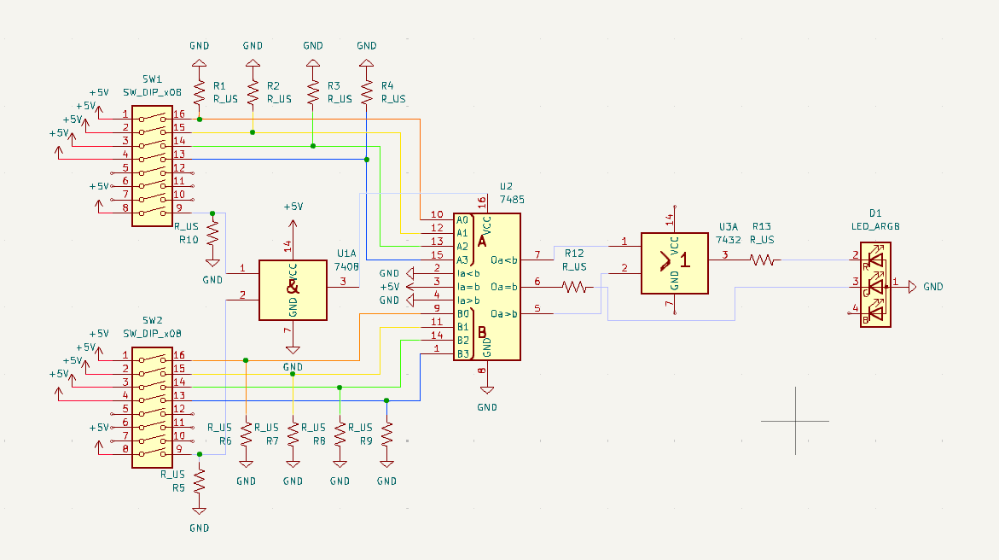
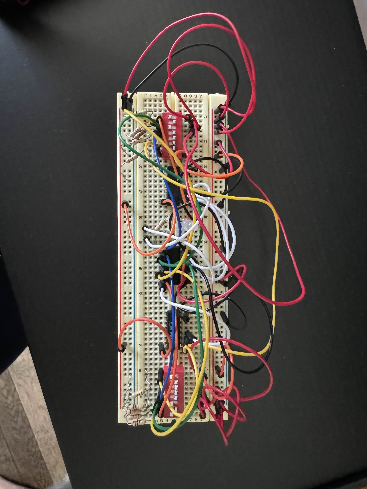
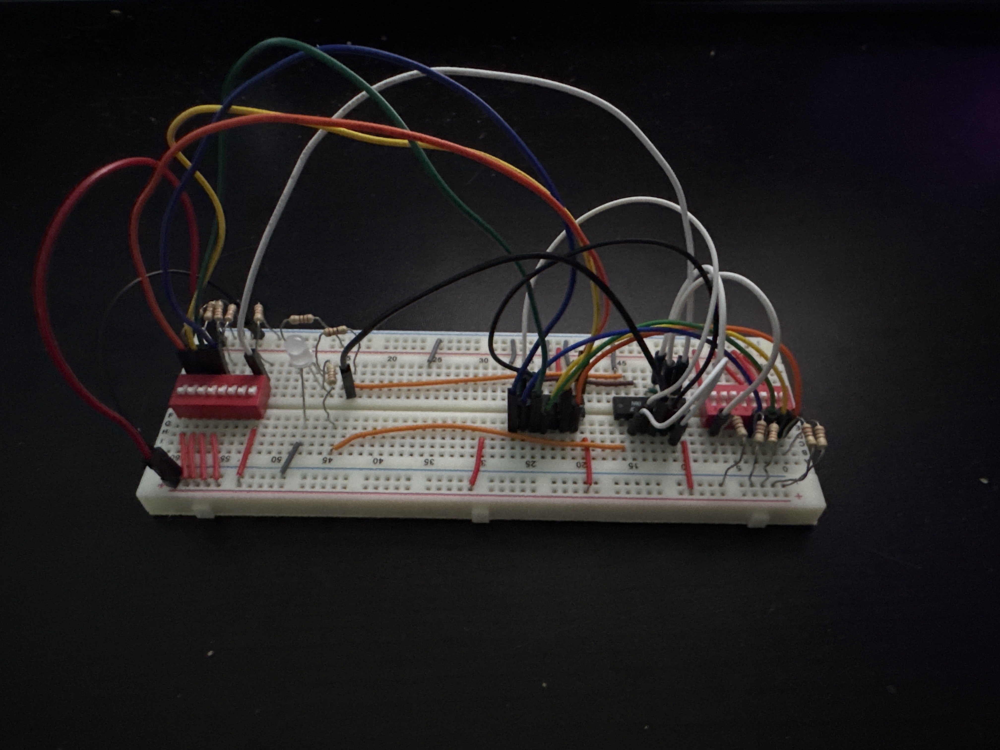

# Circuit 1: Guess the Number
## Concept:
A 2-player game, there is a switch on both sides of the board one player sets a number on their switch and when they are ready, they flip the last switch to start the game both players have to flip their last switch for the game to start. If the guesser’s number is more or less the light will be red, and if it is correct the light will be green.
## How it works:
For the game to start both players need to have the last switch on the DIP switch set to ON. Both go through an AND gate, and the output of that goes into the VCC pin on the comparator. Once the player who made the number and the guesser flip the last switch, it will compare the numbers. If guesser’s is greater or less than the other players number, it will turn red. This is done through an OR gate, where both the greater then and less then go into. If either is on, then it will send a signal and turn the LED red. If the numbers are equal the LED will turn green.

## Images
### Schematic:

### Circuit 1 on the Breadboard

## Video Demonstration: https://www.youtube.com/watch?v=7WhWaa4iMa8

##Truth Tables
### Output Enable truth table:		  
| A5 B5 |	P (Power) |	 
| :-: | :-------: |
| 0 0 |	0		      |               
| 0 1 |	0		      |               
| 1 0 |	0		      |              
| 1 1 |	1		      |

#### Expression for P:
OE = A5B5

### Red LED truth table
| OE A>B	| R | 
| :-: | :---: |
| 0 0	| 0     |
| 0 1	| 0     |
| 1 0	| 0     |
| 1 1	| 1     |

#### Expression for R:
R = OE AND A>B 

### Green LED truth table
| OE A=B	| G | 
| :-: | :---: |
| 0 0	| 0     |
| 0 1	| 0     |
| 1 0	| 0     |
| 1 1	| 1     |

#### Expression for G:
G = OE AND A=B 

### Blue LED truth table
| OE A<B	| Bl | 
| :-: | :---: |
| 0 0	| 0     |
| 0 1	| 0     |
| 1 0	| 0     |
| 1 1	| 1     |

#### Expression for B:
Bl = OE AND A<B

## Parts Used:
#### 2: 8 Switch DIP Switch
#### 1: 7485 4-bit Magnitude Comparator
#### 1: 7408 Quad AND gate
#### 13: 220 Ohm Resistors
#### 1: RGB LED

