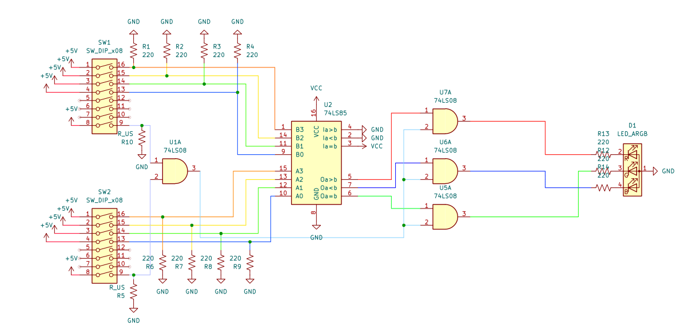
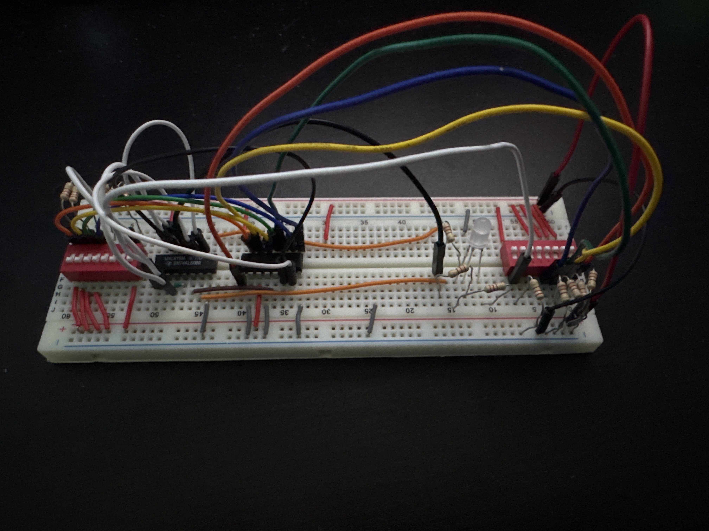

# Circuit 1: Guess the Number
## Concept:
A two player game where one player enters a number and the other player guesses the number. On both player's switch there is a switch that the players both have to switch when the are ready to compare numbers. If player A's number is greater then player B's then the LED will be red, if player A's is less then player B's number then the LED will be blue, and if both are equal the LED will be green.
## How it works:
There are 2 switches, player A has switch A, player B has switch B. The players enter a number into their corresponding switch, and the numbers get compared using a comparator. There are 3 outcomes: A>B, A<B, and A=B. If A>B the LED will be red, if A<B the LED will be blue, and if A=B then the LED will be green. However for the LED to turn on both players must have the last switch turned on. If both are on it allows the signal from the comparator to reach the LED and turn on. 

## Images & Videos
### Schematic:

### Circuit 1 on the Breadboard

## Truth Tables
### Output Enable truth table:		  
| A5 B5 |	P (Power) |	 
| :-: | :-------: |
| 0 0 |	0		      |               
| 0 1 |	0		      |               
| 1 0 |	0		      |              
| 1 1 |	1		      |

#### Expression for P:
OE = A5B5

### Red LED truth table
| OE A>B	| R | 
| :-: | :---: |
| 0 0	| 0     |
| 0 1	| 0     |
| 1 0	| 0     |
| 1 1	| 1     |

#### Expression for R:
R = OE AND A>B 

### Green LED truth table
| OE A=B	| G | 
| :-: | :---: |
| 0 0	| 0     |
| 0 1	| 0     |
| 1 0	| 0     |
| 1 1	| 1     |

#### Expression for G:
G = OE AND A=B 

### Blue LED truth table
| OE A<B	| Bl | 
| :-: | :---:  |
| 0 0	| 0      |
| 0 1	| 0      |
| 1 0	| 0      |
| 1 1	| 1      |

#### Expression for B:
Bl = OE AND A<B

## Parts Used:
#### 2: 8 Switch DIP Switch
#### 1: 7485 4-bit Magnitude Comparator
#### 1: 7408 Quad AND gate
#### 13: 220 Ohm Resistors
#### 1: RGB LED

