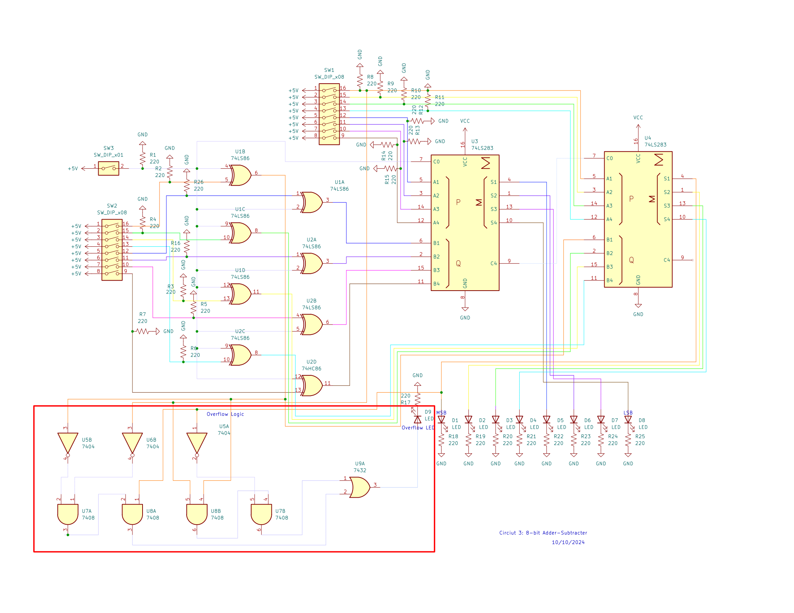

# Circuit 2: 8-bit Adder-Subtracter 
## Concept:
There are 2 switches, 1 for each number. There is also a switch for the mode. When the switch is off, it adds the 2 numbers, and when it is on it subtracts B from A. 
## How it works:
The first switch, Switch A, sends each bit to an adder. The first switch on Switch A is the most significant bit, and the 8th switch is the least significant bit. Switch B however first goes into an XOR gate. Each bit is XORed with the output of the mode switch. If it’s subtracted the bits will be inverted, and the mode switch sends a bit through the carry-in on the adder, making the value 2’s compliment. If it is adding the number will not be inverted. There are 2 adders, the first one handles the 4 least significant bits, and the second one handles the most significant bits. Once the number is added or subtracted, each bit goes to an LED and it will light up if it gets sent a 1. 

## Images
### Schematic

## Table for Addition:		
| A BF Cin | ∑   | Cout |	
| :----------: | :-: | :----: |
| 0 0 0	       | 0	 | 0      | 
| 0 0 1 	     | 1	 | 0	    |	
| 0 1 0        | 1   | 0	    |	
| 0 1 1        | 0	 | 1	    |
| 1 0 0	       | 1	 | 0      |
| 1 0 1        | 0	 | 0      |
| 1 1 0	       | 0   | 1      |
| 1 1 1        | 1   | 1      |

### Expression for ∑ of each bit:
∑ = ABF’ + A’BF or ∑ = A XOR BF

### Expression for Cout:
Cout = A * BF

## Table for XOR’s (Inverting the numbers)
|BI M |	BF |
| :---: | :--: |
| 0	0   | 0    |
| 0 1   | 1    |
| 1 0   | 1    |
| 1 1   | 0    |

### Expression for BF: 
BF = BI’M + BIM’ or BF = BI XOR M

## Parts Used:
### 3: DIP Switch
### 2: 74283 4-bit full adder
### 2: QUAD XOR gate
### 25: 220 Ohm Resistors
### 8: Red LED

***
### Simulation on TinkerCAD
