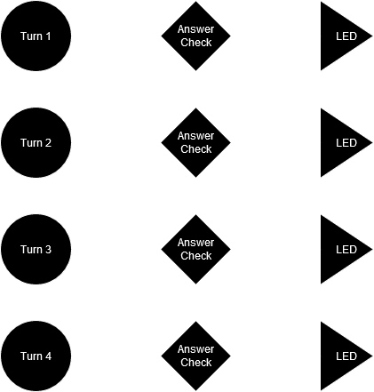
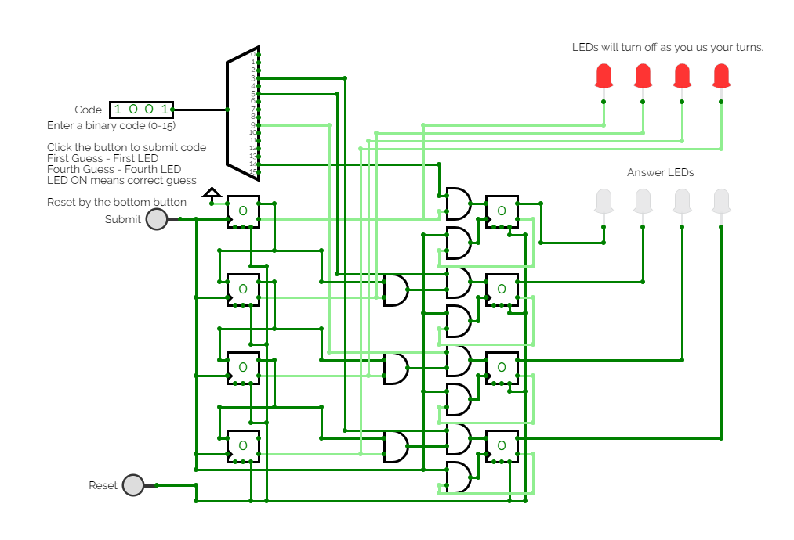
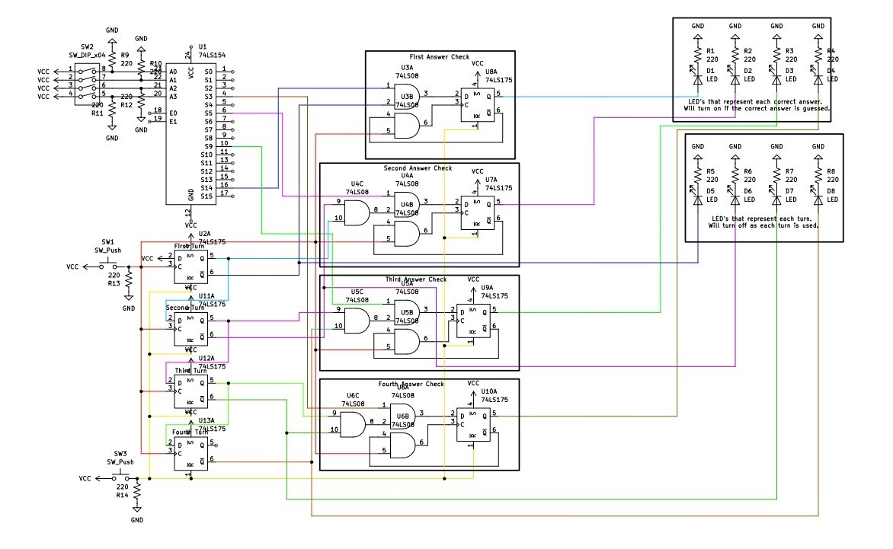

# Circuit 3: Lock Circuit 
## Concept:
You enter 4 different numbers into a "lock". If all four are correct and recieved in the right order, it should "unlock". 
## How it works:
The DIP switch is used to enter the code into. The code entered will go into a decoder, which will output a signal to the codes corresponding pin. Which means that if, for example, 15 was entered into the switch, then the 15 pin on the decoder would send a signal. Using a decoder saved so much time, as I didn't need to create expressions for each answer it optimized the circuit massively as I would have needed a bunch of AND gates and a ton of wires. I simply needed one decoder chip and a wire per answer, making this much more simple to create.

Once the final answer is chosen by clicking the Submit button (the top one), a signal gets sent to 2 Flip Flops. The first column of flip-flops represent the turn you are on. The second column is the answer check flip-flops, these will set to one if the answer is correct. The flip-flops in the circuit work like a ripple counter insofar as that they share a clock source, but they dont really count. They increment, but they dont count numbers. Its like each flip-flop is a step on a staircase, and as you "step" on each flip-flop it gets set to 1. Like I mentioned before each turn flip-flop represents a turn. When you enter 14 for the first answer. The turn flip flop gets set to 1, because D is set to vcc, which also means it can never return to 0 unless the reset button is hit, which asserts the CLR pin. The next turn flip-flops use the Q output of the previous flip-flop to control the D value. If D=1 it allows you to set the flip-flop to one. The answser check flip-flop D value is controlled by the correct answer, the Q' of the next turn flip-flop, and for all but the first, the Q value of the previous turn flip-flop. This way the only way the flip-flip can set to 1 is if you have the right answer, you arent on the next turn, and you arent on the previous turn. Each answer flip-flop will only clock if the submit answer button is pressed and if the Q' value of the same flip-flop is 1, which means the flip-flop hasnt been activated yet. If the answer is right the corresponding LED will light up. To reset the circuit click the reset button (the bottom button).

## Images
### Turn & Answer Block Diagram

#### If the answer is right the flip-flop will become one and the LED will turn on.
### Simulation

### Schematic

## Expressions
### Expression for Turn Flip-Flops
DTA = 1
DTB = QTA
DTC = QTB
DTD = QTC

###Expressions for Answer Check Flip-Flops
DAA = A1Q'TA
DAB = A2Q'TBQTA
DAC = A3Q'TCQTB
DAD = A4Q'TDQTC

CLKA = Q'AACLK
CLKB = Q'ABCLK
CLKC = Q'ACCLK
CLKD = Q'ADCLK

## Parts Used:
#### 8: 7474 Dual D Flip-Flops
#### 4: 7408 QUAD AND Gate
#### 1: 74154 4-16 Decoder

***
### Simulation: [Circuitverse](https://circuitverse.org/simulator/edit/lock-circuit-9322b070-b124-4427-a766-c93bc677ccae)
