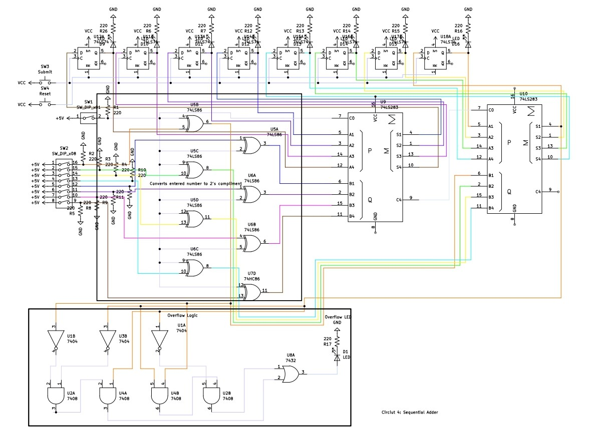

# Circuit 4: Sequential Adder/Subtracter
## Concept:
An Adder/Subtracter that lets you keep adding and subtracting. Now instead of only 2 numbers you can add or subtract as many as you like.
## How it works:
It works like a typical adder subtracter circuit, instead instead of 2 switches that determine the numbers being added, its 1 switch and a set of flip-flops. You enter a 2's compliement number in the switch. Then you click the submit button. This will be the number you will add/subtract from. The second number you enter will be added on or subtracted from your first number. Once you hit submit, the answer of those 2 numbers will be loaded into the flip-flop, and you can keep adding/subtracting forever. When you want to return to 0 you can click the Reset button. The circuit will warn you of overflow if the number you want to add or subtract from will result overflow if you submit. The Flip-Flops D value is controlled by the Sum of the corresponding adder bit.

## Images
### Simulation

#### Overflow Logic

#### 2's Compliment

##### Dark Mode makes labeling hard to see. On simulation you can see labels

### Schematic

## Expressions
##### Since this is based off of Circuit 2, im not going to repeat expressions and tables
### Flip-Flop Expressions
#### Dx = ∑x
##### Each Flip-Flop's D value is equal to the corresponding Sum

#### Ax = Qx
##### Each A value on the adders is equal to the corresponding Flip-Flop Output

## Parts Used:
### 8 - D Flip-Flop
### 2 - Push Button
### 2 - DIP Switch
### 2: 74283 4-bit full adder
### 2: QUAD XOR gate
### 8: Red LED
### 1: Quad OR gate
### 1: Quad AND gate
### 1: Hex Inverter
***
### Simulation: [Circuitverse](https://circuitverse.org/users/266288/projects/sequential-adder-6b3885f1-8d23-4b58-8af6-ee33cb3daf25)
