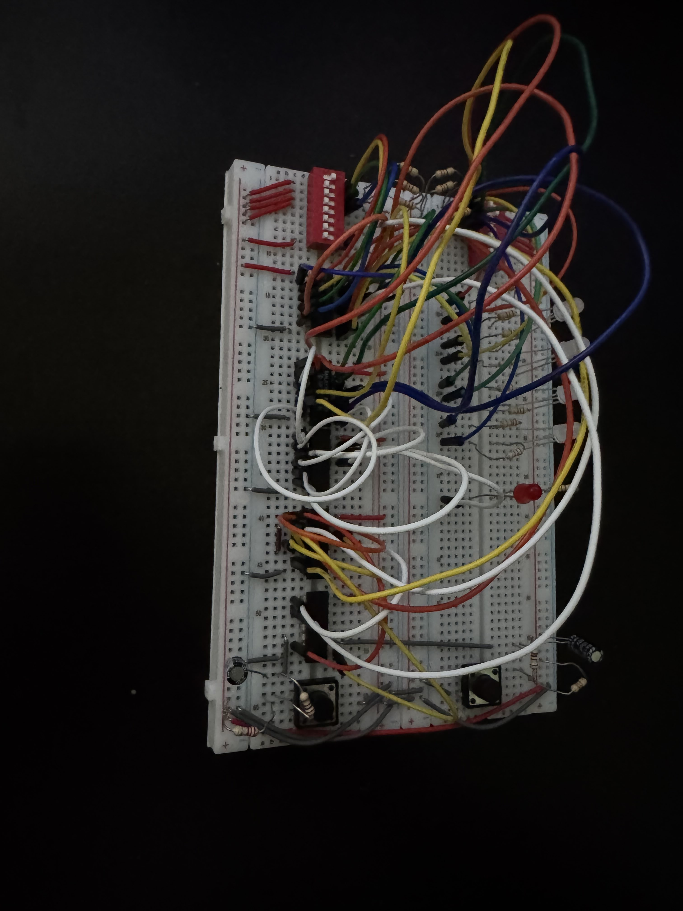
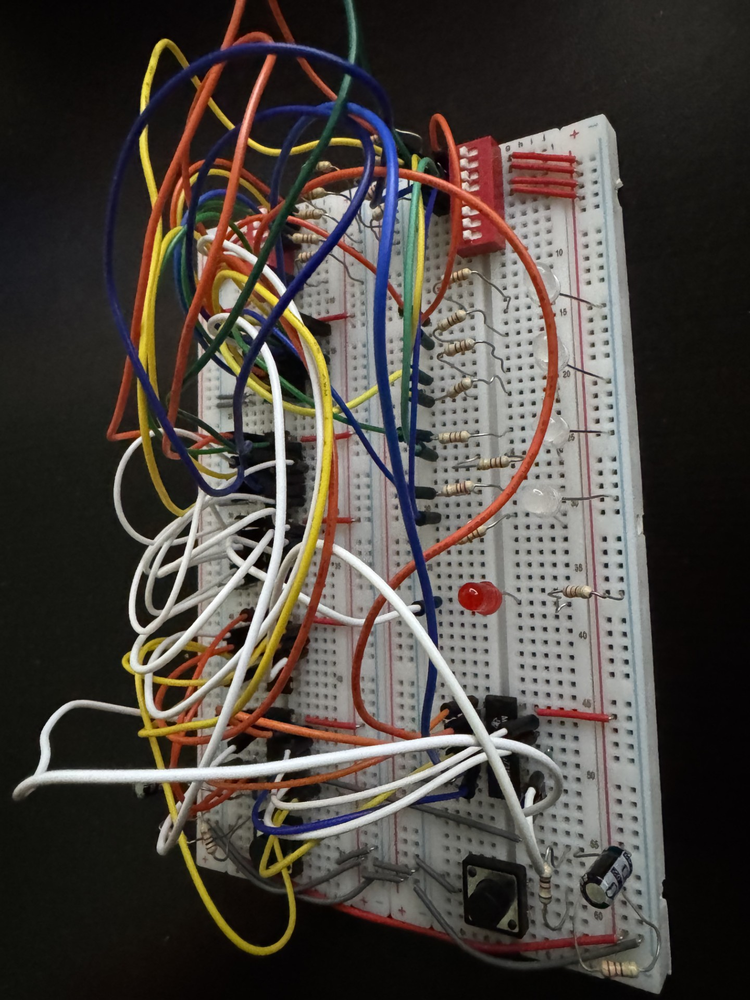
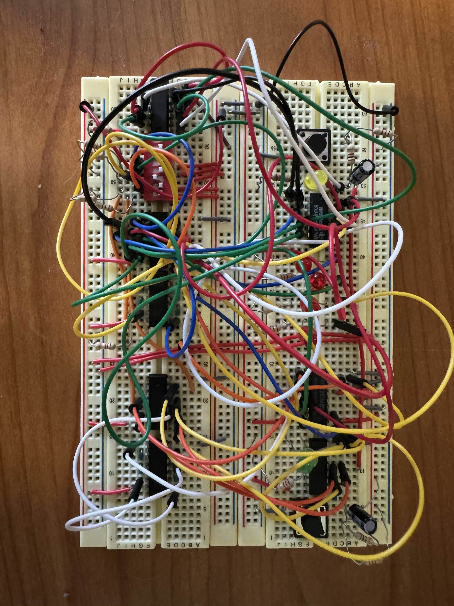

# Circuit 5: Looping Shift Register & Point System
## Concept:
For my final project I needed to create a point system for the game, where if the player is on the same spot an an object, you will get a point. I also wanted to get looping on a shift regsister working. The switch represents the object, and the register represents the player.

## How it works:
There are 2 buttons, one does the left movement and one does the right movement. S1 is controlled by the shift Left button or the load switch. I will get to that later. S0 is controlled by the shift left button or the load switch. To start you need to load a value. There is a DIP switch with 5 inputs. The very last is the switch that you toggle if you want to load. Once its toggled it makes S1 = S0 = 1, which makes the register load. Usually, the shift register will delete the data after it shifts to far to the left/right. The CLK is controlled by if either the left or right button is pressed and if the CLK is enabled. The CLK is disabled if you try to go left when you are already at the left most point, and if you try to go right when you are already at the right most point. This is to prevent the player from being deleted. To avoid timing issues, I inverted the CLK signal to make it falling edge triggered. The DIP switch is used to decide the location of the object. There are 4 switches for the object, each corresponding to an LED. The Player uses a green LED, and the object uses the red LED. If both the Player and object are at the same LED, an additional LED will go on to signify you gaining a point for hitting the object. 

## Images
### Schematic

### On The Breadboard

## Expressions
### Register Expressions
#### S1 = R + Ld
#### S0 = L + Ld
#### CLK = R + L + CLKEN
#### CLKEN = (QAR + QDL)'
###### I am not using a NAND gate because I didn't want to unnecessarily add another chip to the board

##### R = Shift Right Button
##### L = Shift Left Button
##### Ld = Load Switch

### Point LED Expression
#### LEDpoint =  QAA + QBB + QAC + QAD

##### Qx = Output of Register
##### X = Output of DIP Switch

## Parts Used:
#### 1: 74194 Universal Bidirection Shift Register
#### 2: Push Buttons
#### 1: 7414 Schmitt Inverter
#### 2: 7404 Hex Inverter
#### 3: 7432 OR Gate
#### 1: 7408 AND Gate
***

