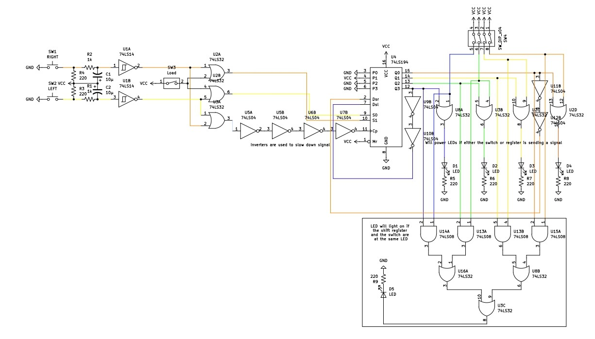

# Circuit 5: Looping Shift Register & Point System
## Concept:
For our final project we needed to create a point system for Pac-man, where if he lands on the same spot a pellet is, the player will get a point. I also wasn't satifsied that we werent gonna do any looping so I wanted to get that working as well.

## How it works:
There are 2 buttons, one does the left movement and one does the right movement. S1 is controlled by the shift Left button or the load switch. I will get to that later. S0 is controlled by the shift left button or the load switch. The CLK is controlled by if either the left or right button is pressed. However, there needed to be a delay for the CLK to work, as either S1 or S0 need to be a 1 by the time the CLK is set to 1 for it to work, so it is inverted twice to delay it enough for it to work. To start you need to load a value. There is a DIP switch with 5 inputs. The first is the switch that you toggle if you want to load. Once its toggled it gets OR'd with the shift left button which gets sent to the SI pin, and it also gets OR'd with the shift right button which gets sent to the S0 pin. An issue with the shift register that I have is that if you keep shifting after your data gets to the last point, it will simply dissapear, so I wanted to make it loop. How I made it loop left is I used the right most LED input and inverted to twice, as it needs to stay 1 while when it clocks, and put it into the serial right, and I did the same with the left LED input and the serial left pin. The DIP switch is also used to decide the placement of the pellet. There are 4 more switches, each corresponding to an LED. The logic the LED uses to light up is if the corresponding switch is flipped, or if the register is on for that output. If both the register and switch or at the same LED, an  additional LED will go on to signify you gaining a point for hitting the pellet. 

## Images
### Schematic

## Expressions
### Register Expressions
#### S1 = R + Ld
#### S0 = L + Ld
#### CLK = R + L

### LED Expressions
#### LED1 = QA + A
#### LED2 = QB + B
#### LED3 = QA + C
#### LED4 = QA + D
#### LEDpoint =  QAA + QBB + QAC + QAD

### Video Demonstration: https://www.youtube.com/watch?v=Nvhwvm_-pvM
## Parts Used:
#### 1: 74194 Universal Bidirection Shift Register
#### 2: Push Buttons
#### 1: 7414 Schmitt Inverter
#### 2: 7404 Hex Inverter
#### 3: 7432 OR Gate
#### 1: 7408 AND Gate
***

