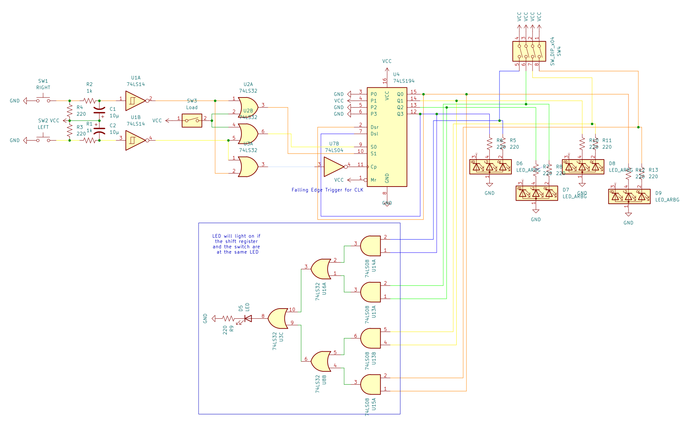

# Circuit 5: Looping Shift Register & Point System
## Concept:
For our final project we needed to create a point system for Pac-man, where if he lands on the same spot a pellet is, the player will get a point. I also wasnt satifsied that we werent gonna do any looping so I wanted to get that working as well.

## How it works:

## Images
### Schematic

## Parts Used:
#### 1: 74194 Universal Bidirection Shift Register
#### 2: Push Buttons
#### 1: 7414 Schmitt Inverter
#### 2: 7404 Hex Inverter
#### 3: 7432 OR Gate
#### 1: 7408 AND Gate
***
### Simulation on TinkerCAD

