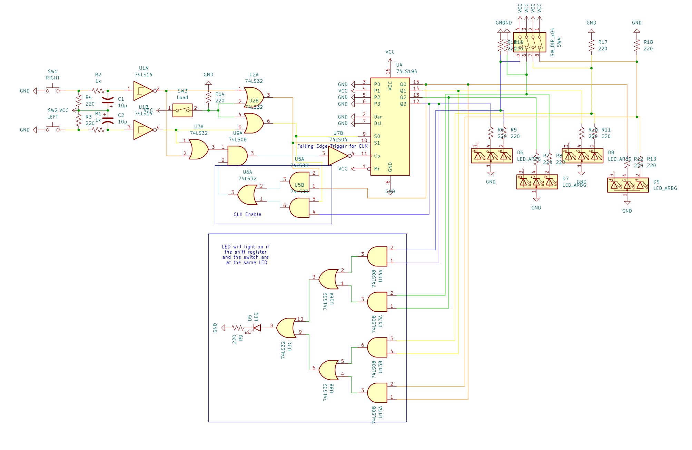
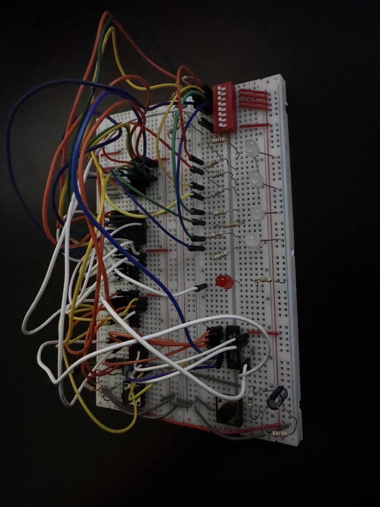
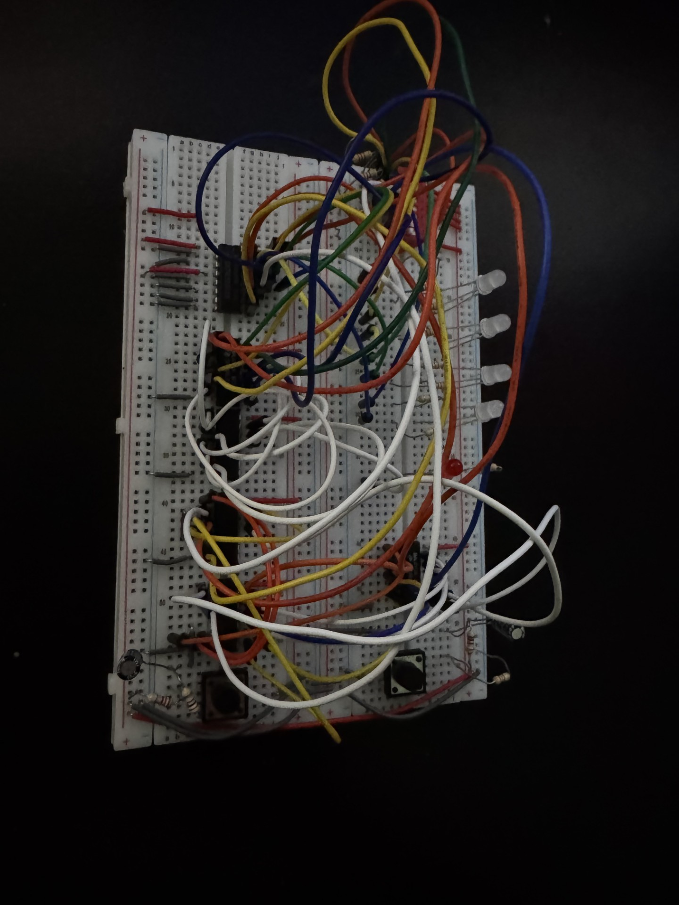
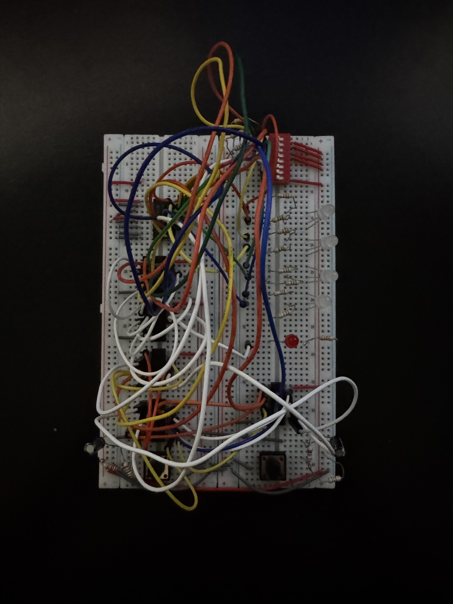

# Circuit 5: Looping Shift Register & Point System
## Concept:
For my final project I needed to create a point system for the game, where if the player is on the same spot an an object, you will get a point. I also wanted to get looping on a shift regsister working. The switch represents the object, and the register represents the player.

## How it works:
There are 2 buttons, one does the left movement and one does the right movement. S1 is controlled by the shift Left button or the load switch. I will get to that later. S0 is controlled by the shift left button or the load switch. The CLK is controlled by if either the left or right button is pressed. To avoid timing issues, I inverted the CLK signal to make it falling edge triggered. To start you need to load a value. There is a DIP switch with 5 inputs. The very last is the switch that you toggle if you want to load. Once its toggled it makes S1 = S0 = 1, which makes the regoster load. Usually, the shift register will delete the data after it shifts to far to the left/right. To make it loop instead, I connected QD to the Serial Left input pin. Similarly, I connected QA with the Serial Right input. The DIP switch is also used to decide the placement of the pellet. There are 4 more switches, each corresponding to an LED. The logic the LED uses to light up is if the corresponding switch is flipped, or if the register is on for that output. If both the register and switch or at the same LED, an  additional LED will go on to signify you gaining a point for hitting the pellet. 

## Images
### Schematic

### On The Breadboard

## Expressions
### Register Expressions
#### S1 = R + Ld
#### S0 = L + Ld
#### CLK = R + L

##### R = Shift Right Button
##### L = Shift Left Button
##### Ld = Load Switch

### LED Expressions
#### LED1 = QA + A
#### LED2 = QB + B
#### LED3 = QA + C
#### LED4 = QA + D
#### LEDpoint =  QAA + QBB + QAC + QAD

##### Qx = Output of Register
##### X = Output of DIP Switch

## Parts Used:
#### 1: 74194 Universal Bidirection Shift Register
#### 2: Push Buttons
#### 1: 7414 Schmitt Inverter
#### 2: 7404 Hex Inverter
#### 3: 7432 OR Gate
#### 1: 7408 AND Gate
***

