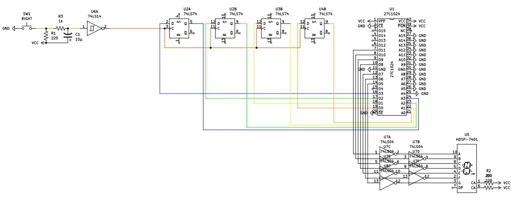

# Circuit 6: EPROM Counter & 7-Segment Decoder
## Concept:
A Syncronous Counter that goes through 0-9 out-of-order. Typically, this would require lots of simplification of expression, picking which flip-flop you want to use, and lots of AND and OR gates. However, using EPROM you can skip all that only while using 1 chip. It requires no expression, makes using a D flip-flop the obvious choice, and requires 0 external logic gates. The EPROM will also decode the number on the counter for a 7-segment display, so I can skip using a 7-segment decoder.     

## How it works:
A debounced push-button serves as the clock for the counter. The D values for each flop-flop come from the EPROM. The LSB of the EPROM for the LSB of the counter. The least significant digit of the HEX is used for the counters. The next 2 digits are used for the 7-segment display. The MSB of those 2 is used for a-b-c-d, and the LSB of those 2 is used for e-f-g-0. Since there are only 7-segments, I left that last bit as a 0 for all values. Since I only need 3 digits of HEX I left the MSB as a 0, although I could have left it as anything as it isn't used at all. The only inputs of the EPROM are the outputs of the flip-flop's, so there are 4 inputs and 11 outputs. The reason I choose to use the 27C1024 is I needed a minimum of 

Since it goes through 0-9, I initially only programmed the EPROM up to 9, but when I turned on the circuit the flip-flops started with all 1's. Instead of having a button to clear, I wanted to do as much with the EPROM as I could and programmed it so that if any unplanned number (10-15) was loaded into the counter it would reset to 0 on the next clock.

Something that was unplanned for was the Common Anode 7-segment, which required me to invert the EPROM's output to the 7 segment. If I could reprogram it, it wouldn't have been necessary to use an inverter.

## Images
### Schematic

## EPROM
| Address | Programmed HEX |	
| :--------------: | :--: |
| 0000000000000000 | 0FC7 | 
| 0000000000000001 | 0604 |
| 0000000000000010 | 0DA5 |
| 0000000000000011 | 0F29 |
| 0000000000000100 | 0666 |
| 0000000000000101 | 0B61 |
| 0000000000000110 | 0BE0 |
| 0000000000000111 | 0E03 |
| 0000000000001000 | 0FE2 |
| 0000000000001001 | 0F68 |
| 0000000000001010 | 0000 |
| 0000000000001011 | 0000 |
| 0000000000001100 | 0000 |
| 0000000000001101 | 0000 |
| 0000000000001110 | 0000 |
| 0000000000001111 | 0000 |

## Parts Used:
#### 2: 7474 Dual D Flip Flops
#### 1: Push Buttons
#### 1: 7414 Schmitt Inverter
#### 1: 27C1024 EPROM
#### 2: 7 Segment Displays
***

