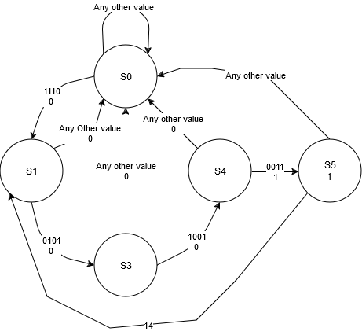

# Circuit 7: Finite State Lock Circuit
## Concept:
After learning about finite state machines, I realized it would be a good fit for my previous lock circuit and wanted to reiterate on it. It is a combination of both a Mealy and Moore machine. The reason for the Mealy machine is because if I had used only a Moore it would have required 3 variable assignments, but an issue with the Mealy machine is that the last code entered would "unlock" the circuit without hitting the submit button, so I decided to add a third flip-flip so that when the Mealy machine was at its final state and you had the right code, instead of immedietly unlocking, you had to press the submit button to unlock.

## How it works:
There are 4 states for the Mealy Machine. The first is the reset state. Once you enter the first code (14, 1110), it will go to the next state, S1 (01). Then after the second code (5, 0101), it will go to S3 (10). Then when you enter the third code, it goes to S4 (11), which outputs a 1, which allows the Moore machine to enter its first state, S5 when the fourth code is entered (3, 0011). When state 5 is reached it will output a 1, which goes into an LED, telling the user the circuit is unlocked. Once the button is pressed again the circuit will reset back to the reset state. If 14 is entered while it is unlocked, it will go to S1 instead of S0.

## Images
### Schematic

### Simulation

### State Diagram

### State Table

## Expressions
### Mealy Machine
J1 =  A'B C'D Q2

K1 =  A' + D' + C + B + Q2

J2 =  A B C D'Q1' + A B'C'D Q1

K2 =  1

Z  =  A'B'C D Q1 Q2 

### Moore Machine
D = Z

## Parts Used:
#### 4: 7474 Dual D Flip Flops
#### 3: Push Buttons
#### 1: 7414 Schmitt Inverter
#### 1: 7404 Hex Inverter
#### 2: 7448 7 Segment Decoders
#### 2: 7 Segment Displays
#### 3: 7408 AND Gate
***
### Simulation: [Circuitverse](https://circuitverse.org/users/266288/projects/finite-state-lock-circuit)

