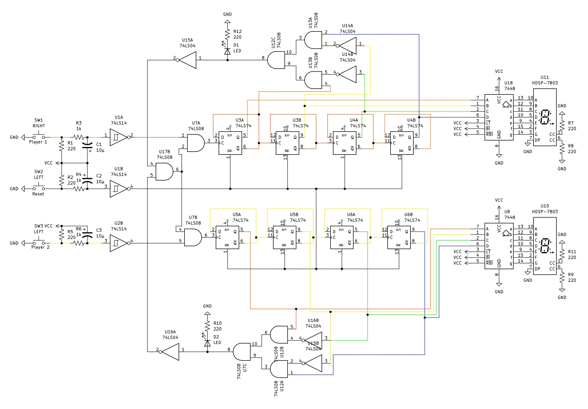

# Circuit 5: Looping Shift Register & Point System
## Concept:
A 2-player game, there is a button for each player on either side of the board. Each player clicks the button as fast as they can until the number displayed reaches 9. Once it reaches that point the game freezes, and an LED will light up on the side of whoever one.

## How it works:
There are 3 buttons. 2 are for the players and 1 is to reset the counters. Each player has their own 4-bit ripple counter, which sends each of their numbers into a 7 segment decoder from there into a 7 segment display. The counters will only go to 9. The first player to reach 9 will stop BOTH ripple counters It stops by inhibiting the clock signal on both when it either get to 9. On each players side, there is an AND gate used to detect if the counter is 9. Once it does, a signal is sent to both an inverter and LED. The LED is used to say who won the game. The inverter goes to an AND gate with the other player's inverter. The signal from that goes to 2 AND gates, one with each players button, and that goes into the clock of the counter. To reset the counters, you have to hit the reset button. 

## Images
### Schematic

## Expressions
### Clock Expression
#### CLKP1 = (AP1BP1'CP1'DP1)'(P1)
#### CLKP2 = (AP2BP2'CP2'DP2)'(P2)

### LED Expression
#### LEDP1 = (AP1BP1'CP1'DP1)
#### LEDP2 = (AP2BP2'CP2'DP2)

##### R = Shift Right Button
##### L = Shift Left Button
##### Ld = Load Switch

### LED Expressions
#### LED1 = QA + A
#### LED2 = QB + B
#### LED3 = QA + C
#### LED4 = QA + D
#### LEDpoint =  QAA + QBB + QAC + QAD

##### Qx = Output of Register
##### X = Output of DIP Switch

## Parts Used:
#### 1: 74194 Universal Bidirection Shift Register
#### 2: Push Buttons
#### 1: 7414 Schmitt Inverter
#### 2: 7404 Hex Inverter
#### 3: 7432 OR Gate
#### 1: 7408 AND Gate
***

